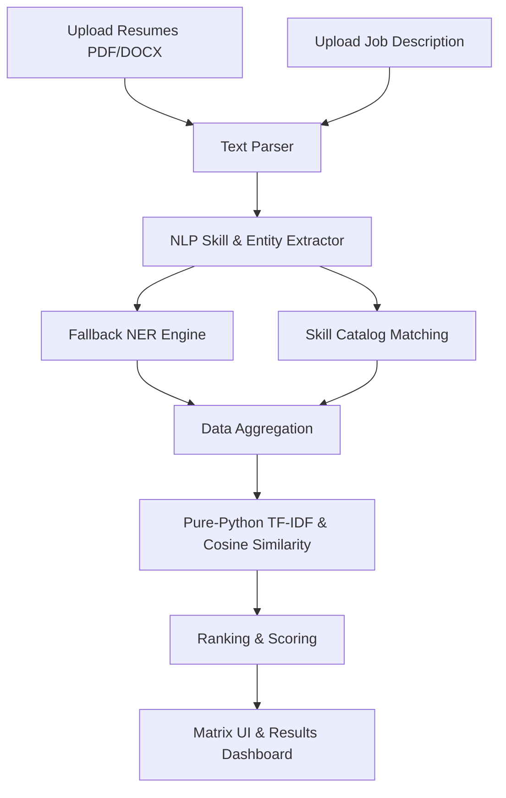

# Resume Screening & Skill Extraction AI (Flask Edition)

An advanced AI-powered platform designed to streamline recruitment by automatically screening resumes and extracting key technical and soft skills using NLP (Natural Language Processing) and NER (Named Entity Recognition).

## 🚀 Features
- **Intelligent Screening**: Ranks candidates against a Job Description using a custom-built, lightweight TF-IDF Cosine Similarity and Keyword Matching algorithm.
- **Skill Extraction**: Automatically identifies and categorizes technical skills, soft skills, and tool proficiencies.
- **Dual Format Support**: Processes both PDF and DOCX resumes seamlessly.
- **Interactive Dashboard**: Premium glassmorphism UI with real-time filtering, match scoring visualizations, and candidate comparisons.
- **Custom Catalogs**: Support for custom skills catalogs via XLSX for industry-specific tailoring.

## 🧠 System Architecture



## 🛠️ How It Works

1.  **Ingestion Engine**: The platform accepts multi-format resume artifacts (PDF/DOCX). It uses `pypdf` and `python-docx` for loss-less text extraction.
2.  **Semantic Extractor**: Our lightweight NLP pipeline identifies entities like `Name`, `Email`, `Phone`, and `Education`. It cross-references text against a pre-defined and custom skill catalog.
3.  **Vector Matcher**: Instead of simple keyword counting, it converts both the resume and the job description into numerical vectors.
4.  **Hybrid Scoring**: It calculates similarity using **TF-IDF** (Term Frequency-Inverse Document Frequency) and **Cosine Similarity**, weighted alongside direct keyword overlap to produce an accuracy percentage.
5.  **Intelligence Dashboard**: Results are streamed to a high-performance glassmorphism UI, featuring interactive charts (Chart.js) and a skill comparison matrix.

## 🛠️ Technology Stack
- **Backend**: Flask (Python 3.x)
- **Text Extraction**: pypdf, python-docx
- **Machine Learning**: Custom Pure-Python Vector Math Algorithms
- **Data Processing**: openpyxl
- **Frontend**: Vanilla HTML5, CSS3 (Premium Glassmorphism), Modern JavaScript (ES6+)

## 📦 Installation & Setup

1. **Clone the project**
   ```bash
   git clone https://github.com/Abhishek-Maheshwari-778/Resume-Screening-Skill-Extraction-Ai-flask.git
   cd Resume-Screening-Skill-Extraction-Ai-flask
   ```

2. **Create a Virtual Environment (Recommended)**
   ```bash
   python -m venv .venv
   source .venv/bin/activate  # On Windows: .venv\Scripts\activate
   ```

3. **Install Dependencies**
   ```bash
   pip install -r requirements.txt
   ```

4. **Install spaCy Model**
   ```bash
   python -m spacy download en_core_web_sm
   ```

5. **Run the Application**
   ```bash
   python flask_app.py
   ```
   *The app will be available at `http://localhost:5000`*

## 👤 Owner
**Abhishek Maheshwari**
- Project Lead & AI Developer
- [LinkedIn Profile](https://www.linkedin.com/in/abhishekmaheshwari2436/)
- [GitHub Profile](https://github.com/Abhishek-Maheshwari-778)

---
*Developed as part of the Final Year Project at Invertis University (BCA 2023–26).*
